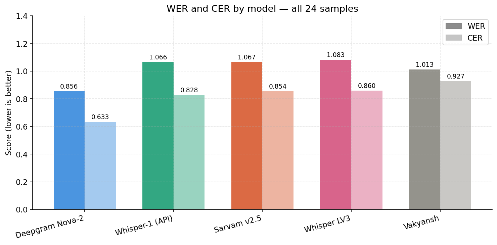
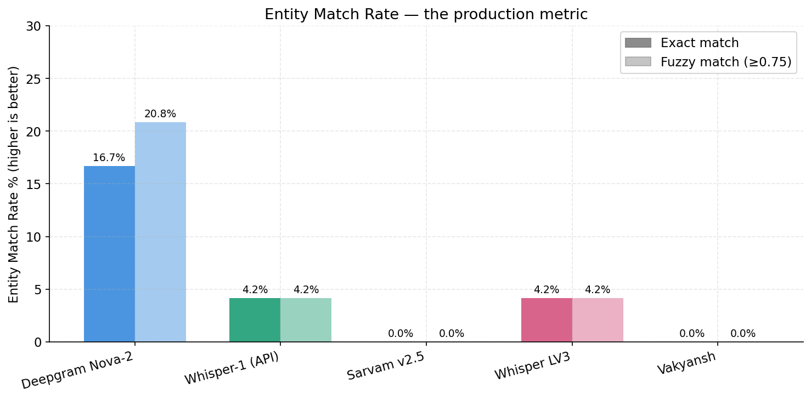
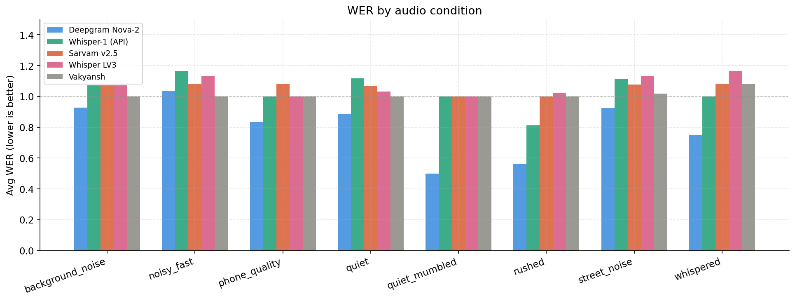
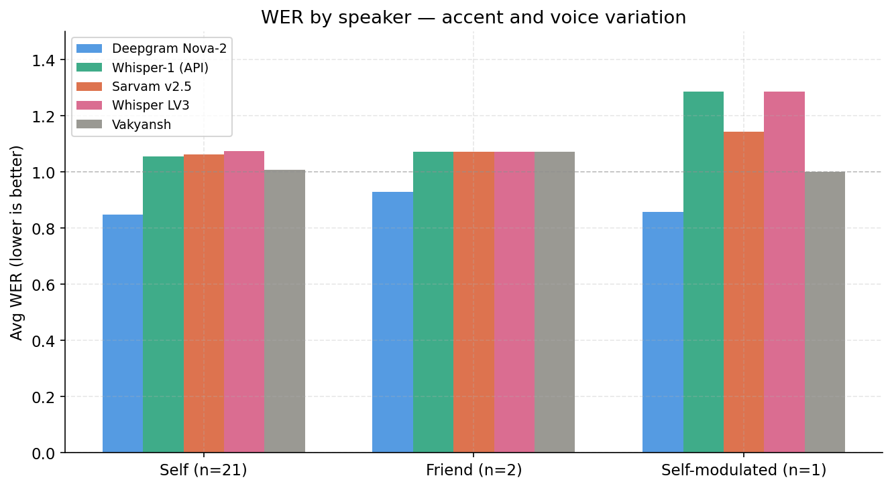
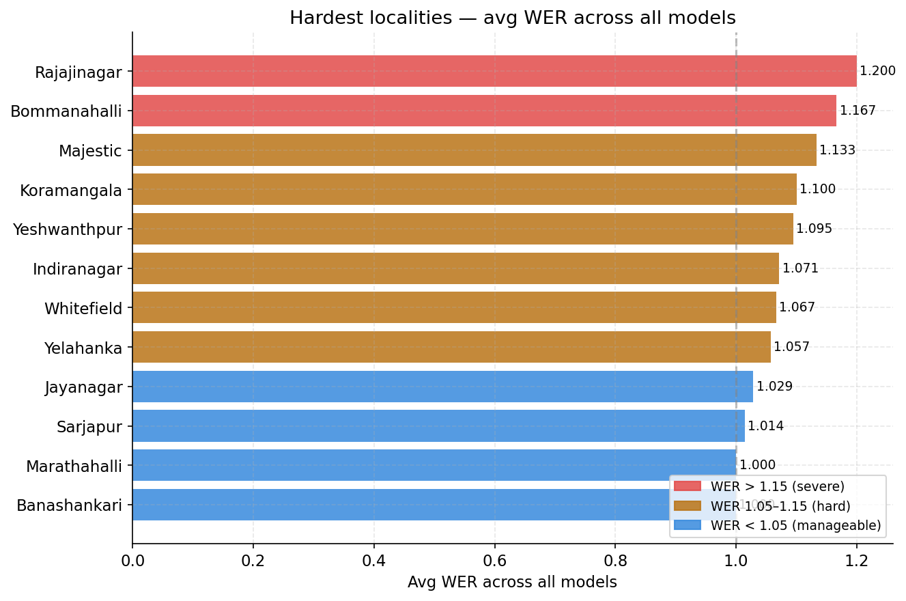
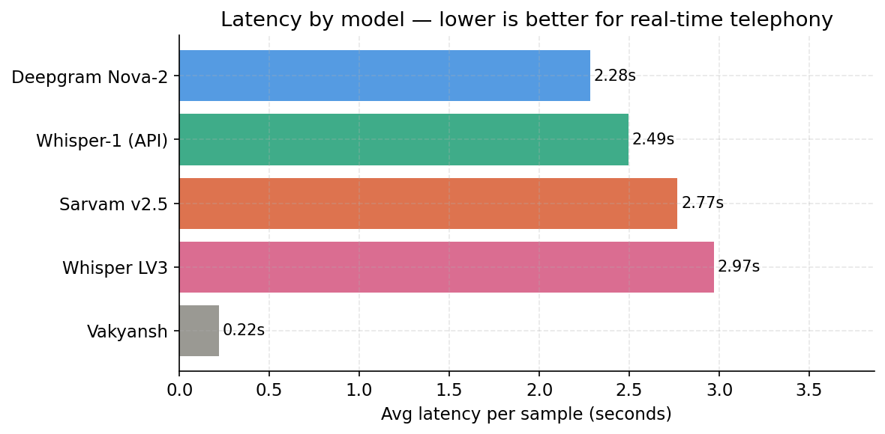

# ASR Benchmark — Bangalore Locality Names
### Evaluating Speech Recognition for a Blue-Collar Hiring Platform's Voice Stack

> **Context:** Candidates interact with a hiring platform via phone calls and WhatsApp voice notes — often in Hindi, Hinglish, or regional languages, in noisy environments, over low-bandwidth connections. The core NLP task is not general transcription quality. It is **entity extraction**: did the ASR correctly capture where the candidate lives?

---

## Table of Contents
1. [Problem Framing](#1-problem-framing)
2. [Model Selection](#2-model-selection)
3. [Dataset](#3-dataset)
4. [Metrics](#4-metrics)
5. [Results](#5-results)
6. [Failure Analysis](#6-failure-analysis)
7. [Open-Source Datasets](#7-open-source-datasets)
8. [Recommendation](#8-recommendation)
9. [Limitations](#9-limitations)

---

## 1. Problem Framing

Standard ASR benchmarks measure transcription quality against clean reference text. That is the wrong framing here.

Consider this example:

| Ground truth | Hypothesis | WER | Entity captured? |
|---|---|---|---|
| "haan main koramangala mein rehta hoon" | "हां मैं कोरामंगला में रहता हूं" | 1.00 | ✓ Phonetically correct |
| "haan main koramangala mein rehta hoon" | "हां मैं कोरामला में रहता हूं" | 1.00 | ✗ Locality mangled |

Both score WER = 1.0 because the ground truth is in Roman script and the model output is in Devanagari. But one correctly captured the locality and one did not. **WER cannot distinguish these cases.**

The right question is: **did the ASR output contain a recognisable form of the locality name?** That is what Entity Match Rate measures, and that is what drives the evaluation design here.

---

## 2. Model Selection

The goal was to cover every axis a production team would care about: API vs self-hosted, general multilingual vs India-specific, and different model sizes. Five models were benchmarked.

### Deepgram Nova-2 — Baseline (API)
Required baseline. Nova-2-general natively supports Hindi and Hinglish code-switching. It is the only model in this benchmark with real-time **streaming support** — critical for a live telephony stack where you need first-byte latency, not just total latency. At ~$0.004/min it is also cost-competitive.

### OpenAI Whisper-1 — Multilingual API Benchmark
Whisper is the standard multilingual ASR benchmark. The hosted `whisper-1` API uses the large-v2 architecture and handles Hindi reasonably well. Its key limitation: **no streaming support** — it is batch-only, which makes it unsuitable for real-time phone call transcription. Included to establish a widely-known reference point.

### Sarvam saarika:v2.5 — India-Specific API
Sarvam is the only API model here purpose-built for Indian languages. It is trained on Hinglish and phone-call audio — exactly the distribution of this task. The hypothesis was: India-specific training data should produce better locality entity extraction than general multilingual models. The results challenged this assumption in an interesting way (see Failure Analysis).

### Whisper Large-v3 — Self-Hosted (Colab T4)
The "bigger model = better" hypothesis and the self-hosting cost tradeoff both needed testing. At scale, running Whisper Large-v3 locally eliminates per-call API costs. The question was whether the accuracy improvement justified the compute overhead. It did not (see Results).

### Vakyansh Hindi-4200 — Open-Source Hindi (AI4Bharat ecosystem)
This model is from the AI4Bharat ecosystem — the same lab that produced the datasets (Kathbath, IndicVoices) listed in the assignment brief. It is a wav2vec2 model trained on Hindi speech, self-hostable at zero API cost. Including it tests whether the open-source Hindi-specific option is viable for production use.

### Models Considered but Excluded

**IBM Granite Speech 3.3-8b** — Reviewed the model card carefully. Supported languages are English, French, German, Spanish, and Portuguese. No Hindi or Indic language training data. Would produce English or garbage output on Hindi audio. Excluded.

**AI4Bharat IndicConformer-600M** — Strong candidate: 600M multilingual model covering all 22 official Indian languages including Hindi and Kannada (relevant for Kannada-origin locality names like Banashankari, Yelahanka). Excluded due to access gate not being approved in time. Noted as a limitation — this would be the first model to add in a follow-up evaluation.

---

## 3. Dataset

### Self-Recorded Audio (24 files)

20 primary samples — one per Bangalore locality — plus 4 additional samples with different speakers and conditions.

**Why self-recorded?** Open-source Hindi datasets (Kathbath, FLEURS, Common Voice) do not contain Bangalore locality names. The self-recorded dataset is more directly relevant to the production task than any publicly available option.

**Conditions varied:**

| Condition | Description | Localities |
|---|---|---|
| quiet | Indoor, minimal noise | Koramangala, Indiranagar, Whitefield, Electronic City |
| street_noise | Near traffic/road | Marathahalli, Jayanagar, Rajajinagar, Hebbal + 4 extra samples |
| background_noise | Fan or AC running | Yelahanka, Banashankari |
| rushed | Spoken fast | HSR Layout, BTM Layout |
| whispered | Low voice | Majestic, Silk Board |
| phone_quality | Recorded via phone speaker | Bellandur, Sarjapur |
| noisy_fast | Noisy environment + fast speech | Bommanahalli, KR Puram |
| quiet_mumbled | Quiet but mumbled delivery | Peenya |

**Speaker variation:**

| Speaker | Samples | Description |
|---|---|---|
| self | 21 | Primary speaker |
| friend | 2 | Different speaker, different accent |
| self_modulated | 1 | Voice modulated to simulate low-quality call compression |

All sentences spoken naturally in Hindi/Hinglish — e.g. *"Haan main Koramangala mein rehta hoon"*, not a clean studio reading of "Koramangala."

---

## 4. Metrics

### Word Error Rate (WER)
Standard ASR metric — edit distance between reference and hypothesis at word level. **Important caveat:** WER is inflated throughout this benchmark because ground truth is in Roman script but all models output Devanagari. A phonetically correct transcription scores WER ≈ 1.0. Treat WER as a relative ranking signal between models, not an absolute accuracy number.

### Character Error Rate (CER)
Same as WER but at character level. More granular — better at catching near-miss spellings of locality names where a model gets most syllables right but mangles one.

### Entity Match Rate — Exact (EMR-E)
Did the locality name appear verbatim (after normalisation) in the model's output? This is the primary production metric. If the entity is not in the output, the candidate's location was not captured regardless of how fluent the transcription sounds.

### Entity Match Rate — Fuzzy (EMR-F)
SequenceMatcher ratio ≥ 0.75 between the locality name and the closest matching substring in the hypothesis. Catches phonetic near-misses ("Koromangala" for "Koramangala") that exact matching would miss. Relevant because locality names have no standard romanisation — different speakers and models produce different spellings.

### Latency
Wall-clock seconds per API call. Directly affects caller experience. For a real-time telephony stack, anything above 3–4 seconds is a poor user experience.

---

## 5. Results

### Overall Model Comparison

Deepgram leads on both WER (0.856) and CER (0.633) by a significant margin. All other models cluster between 1.0 and 1.1 WER. The CER gap is even more pronounced — Deepgram's 0.633 vs Vakyansh's 0.927 suggests Deepgram is getting more syllables right even when it does not get full words right.

**Note on Vakyansh WER (1.013):** Vakyansh scores between Whisper and Sarvam on WER, which looks deceptively competitive. This is because Vakyansh frequently returns empty transcripts (Hebbal, HSR Layout, Bommanahalli, Yeshwanthpur_2 all returned blank) — and an empty hypothesis against a short ground truth can score lower WER than a wrong transcription. The EMR tells the real story.

---

### Entity Match Rate

This is the plot that matters for production. Deepgram is the only model that successfully captures locality names — 16.7% exact match, 20.8% fuzzy. Every other model scores 0–4.2%.

**The India-specific models (Sarvam, Vakyansh) both score 0% EMR.** The India-specific models produced fully transliterated Devanagari outputs, which reduced direct string-match compatibility with the Roman-script locality database used in evaluation. This is the most counterintuitive finding of this benchmark and is explained in detail in the Failure Analysis section.

---

### WER by Audio Condition

Deepgram leads every condition without exception. The gap is widest on **rushed speech** (Deepgram 0.562 vs all others ~1.0) and **whispered speech** (Deepgram 0.750 vs all others ~1.0+). These are precisely the conditions that occur most often when candidates call from crowded workplaces or shared housing.

Whisper-1 (API) performs relatively better on rushed speech than the other non-Deepgram models — its large-v2 architecture appears to handle fast speech better than Sarvam or the larger Whisper LV3.

---

### WER by Speaker

All models degrade when the speaker changes. Deepgram remains stable across self, friend, and self-modulated voice. The most dramatic degradation is on the **self-modulated voice** sample — Whisper-1 and Whisper LV3 both jump to 1.29 WER. This simulates what happens when audio is compressed or distorted over a low-bandwidth phone call. Deepgram's 0.857 on the same sample is a meaningful advantage for a telephony stack.

---

### Hardest Localities

Two localities stand out as severely hard (WER > 1.15 across all models):

- **Rajajinagar (1.200):** Every model splits this into multiple words — "राजा जी नगर" (3 words from 1). The model has never seen this as a single entity.
- **Bommanahalli (1.167):** 8 syllables, no common Hindi equivalent. All models truncate to "बोमना अली" — dropping the last 4 syllables entirely.

The amber tier (WER 1.05–1.15) includes Majestic, Koramangala, Yeshwanthpur, Indiranagar, Whitefield, and Yelahanka — all for different reasons. Majestic is phonetically ambiguous. Yelahanka is Kannada-origin with no Hindi equivalent. Koramangala gets split into two words by most models.

---

### Latency

Deepgram (2.28s) and Whisper-1 API (2.49s) are fastest among API models. Whisper LV3 (2.97s) on a T4 GPU is slower than both, which combined with its worse accuracy makes self-hosting the larger Whisper model a poor tradeoff.

**Vakyansh at 0.22s** is deceptively fast — this reflects Colab GPU inference on small wav2vec2 model weights, not production deployment latency. In a real deployment, model loading, audio preprocessing, and serving overhead would dominate.

---

## 6. Failure Analysis

### Why India-Specific Models Score 0% EMR

Sarvam and Vakyansh both fully transliterate locality names to Devanagari:

| Locality | Deepgram output | Sarvam output | EMR winner |
|---|---|---|---|
| HSR Layout | "hsr layout sector two में हूँ" | "एचएसआर लेआउट सेक्टर टू में हूं" | Deepgram — kept Roman |
| Indiranagar | "मेरा घर इन्द्रनगर के पास है" | "मेरा घर इंदिरानगर के पास है।" | Sarvam — more accurate |
| Whitefield | "हां मैं whitefield से आता हूं" | "हाँ, मैं व्हाइट फील्ड से आता हूँ।" | Deepgram — kept Roman |

Sarvam's Devanagari output is linguistically more correct. But for a production pipeline doing locality lookup, the input to the matcher is Deepgram's Roman-script output — making it directly matchable against a locality database. **Deepgram's mixed-script output accidentally makes entity extraction easier.** This is an architectural observation, not a quality judgment: any production pipeline using Sarvam would need a Devanagari-to-locality mapping layer.

### Deepgram Confidence Score is Unreliable

Sarjapur was transcribed as **"sir जयपुर road"** — confused with Jaipur, a completely different city 1500km away — with Deepgram confidence score **0.997**. This is the most dangerous failure mode: maximum model confidence on a wrong entity. A production system cannot use Deepgram's confidence score as a quality gate for locality extraction.

### Jayanagar VAD Dropout

Deepgram returned an empty transcript for Jayanagar. The audio had a mumbled lead-in before the locality was clearly spoken. Deepgram's Voice Activity Detection (VAD) rejected the entire clip. Real phone calls frequently have lead-in noise, breathing, or hesitation — **empty response handling and retry logic is non-negotiable in production.**

### Compound Word Splitting

Every model fails on multi-syllable compound locality names by splitting them:

| Locality | Typical output | Pattern |
|---|---|---|
| Rajajinagar | "राजा जी नगर" | Split at word boundaries |
| Bommanahalli | "बोमना अली" | Last half dropped |
| Marathahalli | "मार्था ली" / "marthale" | Phonetically reanalysed |

These are not transcription errors — the models genuinely do not have these as vocabulary items. This is exactly the problem a post-ASR fuzzy locality matcher is designed to solve.

### Bigger Model ≠ Better

Whisper Large-v3 (self-hosted) performs worse than Whisper-1 API on 6 of 8 audio conditions. The additional model capacity does not help on short, code-switched, noisy Hinglish sentences. This is worth noting explicitly: for this specific task distribution, scaling up Whisper does not improve results.

---

## 7. Open-Source Datasets

The assignment lists Kathbath, Mozilla Common Voice Hindi, FLEURS, IndicVoices, and MUCS 2021 as optional datasets for broadening evaluation. Assessment of each:

| Dataset | Relevance to this task | Verdict |
|---|---|---|
| **MUCS 2021** | Hindi-English code-switched speech — closest match to Hinglish caller audio | Worth using for broader WER validation |
| **Kathbath** | Conversational Hindi, multiple speakers, varied accents | Useful for accent robustness testing |
| **IndicVoices** | Large-scale, includes Kannada — relevant for Kannada-origin locality names | Specifically useful for Yelahanka, Banashankari, Hebbal failures |
| Mozilla Common Voice Hindi | Read speech, clean audio — different distribution from phone-call conditions | Limited value |
| FLEURS Hindi | Clean, read speech — same limitation | Limited value |

**Why none were used in this evaluation:** None of these datasets contain Bangalore locality names. The self-recorded dataset is more directly relevant to the production task. Open-source datasets would add value for generalisation testing and speaker diversity — not for the core locality benchmark.

The most valuable follow-up would be: record 5–10 speakers saying the same localities under varied conditions, and test whether the ranking changes. Single-speaker results are directional; multi-speaker results are actionable.

---

## 8. Recommendation

**Use Deepgram Nova-2 as primary ASR.** It wins on every accuracy metric across all conditions and speakers. Its mixed-script output is better suited for locality matching than pure Devanagari. Streaming support makes it the only option for real-time telephony without significant architecture changes.

**Add a fuzzy locality matcher post-ASR — this is not optional.** No model will consistently produce "Bommanahalli" or "Rajajinagar" correctly. A lookup table of locality variants (including Devanagari transliterations, common misspellings, and phonetic near-misses) with SequenceMatcher or edit-distance matching at threshold ~0.75 will recover the majority of entity extraction failures. This layer is where the real accuracy gains are.

**Do not use Whisper in the real-time telephony path.** No streaming support, degraded accuracy on noisy conditions, worst degradation on voice modulation.

**Do not self-host Whisper Large-v3 for this task.** Higher compute cost, worse accuracy than Whisper-1 API, no streaming. The only scenario where self-hosting makes sense is at very high call volume where per-call API costs become significant — and even then, Whisper LV3 would need to be replaced with a better self-hostable option.

**Revisit Sarvam** when they expose mixed-script or romanised output. The 2.77s latency and Indic-focused training are real advantages. The 0% EMR is an output format problem, not a model quality problem — it is fixable with a post-processing transliteration layer.

### Production Tradeoff Summary

| Factor | Deepgram Nova-2 | Whisper-1 API | Sarvam v2.5 | Whisper LV3 | Vakyansh |
|---|---|---|---|---|---|
| EMR (entity accuracy) | **Best — 20.8%** | 4.2% | 0% | 4.2% | 0% |
| Streaming | **Yes** | No | Yes | No | No |
| Avg latency | **2.28s** | 2.49s | 2.77s | 2.97s | 0.22s* |
| Self-hostable | No | No | No | **Yes** | **Yes** |
| ~Cost/min | $0.004 | $0.006 | $0.003 | Compute | Free |
| Confidence reliable | **No** | — | — | — | — |
| Indic-focused | Partial | Partial | **Yes** | Partial | **Yes** |

*Vakyansh latency measured on Colab T4, not production serving infrastructure.

---

## 9. Limitations

**Single primary speaker.** 21 of 24 samples are from one speaker. The friend and self-modulated samples hint at degradation across speakers, but 2 samples is insufficient to generalise. A production evaluation needs 10+ speakers across genders, age groups, and regional accents.

**Batch API only tested.** Streaming latency (first-byte time, partial hypothesis quality) was not measured. For a live call, what matters is how quickly the model produces a usable partial transcript — not total latency. This benchmark does not answer that question.

**Script mismatch in WER.** All WER numbers are inflated because ground truth is Roman and model outputs are Devanagari. Proper evaluation would normalise both to the same script using a transliteration library before computing WER. EMR is the only metric in this benchmark that is not affected by this issue.

**No Kannada-only samples.** Several localities are Kannada-origin (Yelahanka, Banashankari, Hebbal, Jayanagar). A candidate who speaks Kannada rather than Hindi would produce very different audio. This benchmark only covers Hindi/Hinglish speakers.

**IndicConformer not tested.** AI4Bharat's IndicConformer-600M-multilingual — trained on all 22 official Indian languages — was the strongest open-source candidate and was not evaluated due to access gate delay. It would be the first addition in a follow-up.

**24 samples total.** Directional findings, not statistically significant claims. The ranking is consistent enough to trust, but exact numbers should be treated as estimates.
